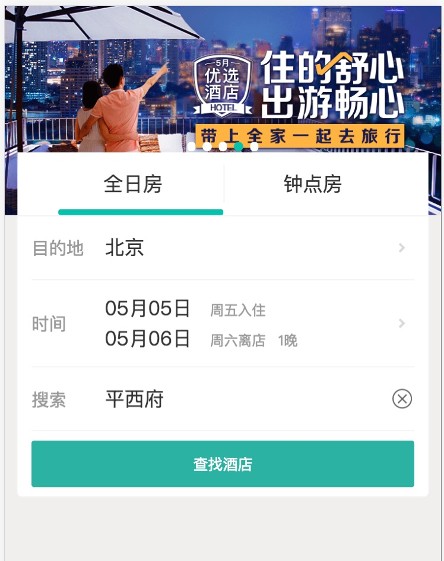
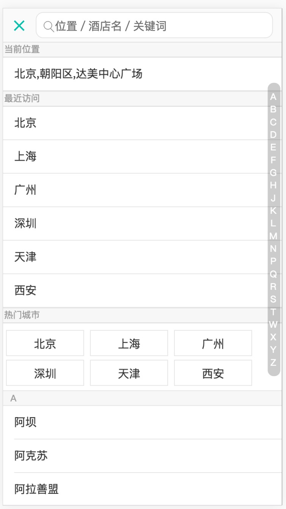
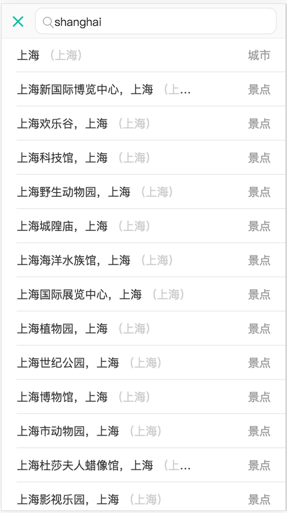
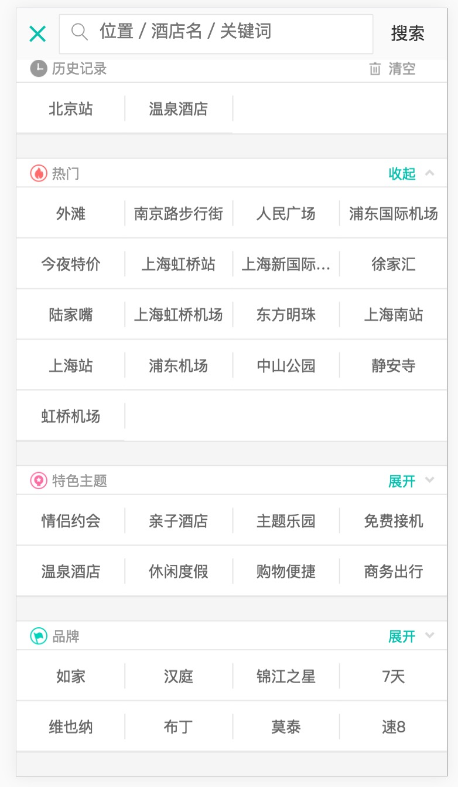
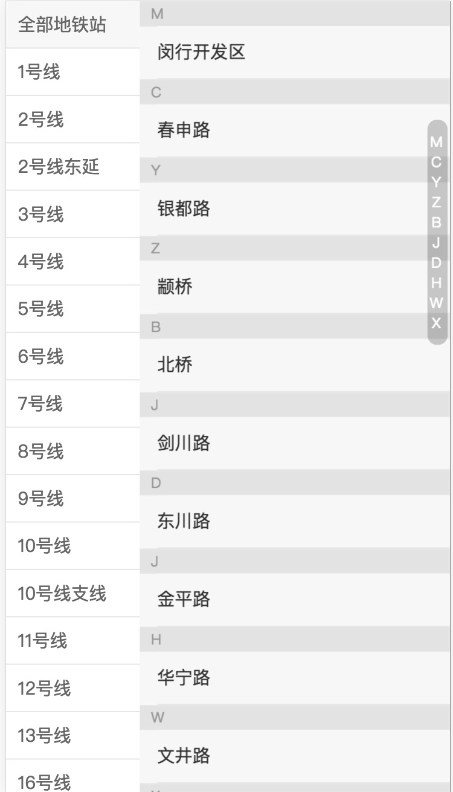

# 关于这个项目
 1. 模仿美团M站的酒店项目，因为曾参与开发途牛国际酒店前端
 2. 项目使用vue + vue-router + vuex, 项目使用vue-cli生成
 3. 接口利用http-proxy-middleware代理美团M站线上接口， 部分无法代理接口根据线上数据存放到文件中
 4. 所有页面模板和样式部分全部借用美团酒店M站线上代码
 5. 采用了[better-scroll](https://github.com/ustbhuangyi/better-scroll)实现了本项目中的滚动效果
 6. 使用了moment来处理时间的格式转化
 7. 利用了vuex-router-sync在状态中存放路由的实例

# 已经完成的
  1. 首页轮播图
  2. 房型选择切换
  3. 首页目的地选择，城市选择列表和城市搜索
  4. 首页入住、离店时间选择，日期选择组件
  5. 首页的hotword选择，如此更多选项滚动列表，suggest搜索

# 接下来要做的
  1. API管理
  2. 文件结构调整

# 思考与总结
  1. 移动端长度单位的兼容性，利用淘宝推荐的[lib-flexible](https://github.com/amfe/lib-flexible)方案，具体可参见https://github.com/amfe/article/issues/17， 本项目中的字体并没有完全按照此方案
  2. 单页应用的中API管理
  3. 路由（URL）参数，应用的状态，组件的状态的同步与维护，利用vuex-router-sync，如何进行更好的管理
  4. 异步的组件来加快应用初始化展示速度

# 项目运行
  1. 由于接口限制，目前仅支持开发模式预览
  clone代码并安装依赖后执行 `npm start`，如果安装失败，请尝试cnpm

# 项目截图
 1. 首页整体效果

 2. 城市选择列表

 3. 城市搜索列表

 4. 首页日期选择

 5. 热词选择

 6. 地铁选择

